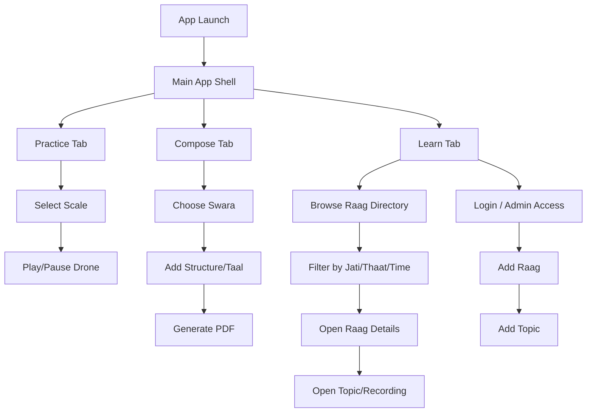

# HCMAI Responsive Website Design Document

## 1. Product Overview

HCMAI is a learning and practice app for Hindustani classical music, focused on three core needs:

- practicing a tanpura or drone reference
- composing and exporting bandish notation
- learning raags and related theory through structured content

The product blends a music practice tool, a notation workspace, and a curated knowledge library. It is designed for students, enthusiasts, and administrators who manage raag content and recordings.

## 2. Purpose of the Application

The app helps learners engage with Hindustani classical music in a practical, guided way:

- Daily riyaz: students can practice with a tanpura-like drone across selected scales
- Notation composition: users can build swara-based notation for bandishes and export a PDF document
- Structured learning: users can browse raags by thaat, jati, and time-of-day and explore educational topics
- Content management: administrators can add raags and recordings, including premium locked content

In effect, the app acts as a digital practice studio and learning library for Hindustani music.

## 3. Target Users

### Primary users
- Music students learning swaras, raags, and bandish structure
- Enthusiasts exploring Hindustani music fundamentals
- Practitioners looking for daily practice support and notation tools

### Secondary users
- Admin/content managers adding raags, learning material, and audio files
- Teachers or mentors curating study content for learners

## 4. App Screens and Functional Areas

The current iOS app maps cleanly to a responsive website with a multi-page experience.

### A. Practice Screen
Name in app: TanpuraView

Purpose:
- Provides a drone or tanpura reference for practice
- Allows users to choose a scale
- Enables playback of a continuous note loop

Key UI elements:
- full-width hero area with large play/pause control
- selected scale indicator
- scale grid for notes like C, C#, D, E, F, etc.
- layout optimized for touch but adaptable to browser interaction

### B. Compose Screen
Name in app: NotationView

Purpose:
- Lets users build notation by tapping swaras
- Supports octave and pitch modifiers
- Adds structural symbols like taals and separators
- Generates a PDF or document export

Key UI elements:
- title input
- notation display area
- octave and pitch segmented controls
- swara keyboard grid
- structure/taal shortcut buttons
- clear/delete actions
- generate shareable PDF

### C. Learn / Library Screen
Name in app: LearnDirectoryView

Purpose:
- Serves as raag directory and browsing hub
- Shows current prahar/time-based recommendations
- Allows filtering by jati, thaat, and time of day
- Provides navigation into raag detail pages

Key UI elements:
- prahar header with recommended raags
- horizontal recommendation pills
- filter form for jati/thaat/time
- library search CTA
- user/admin action buttons for auth and add-raag flows

### D. Raag Detail Screen
Name in app: RaagDetailView

Purpose:
- Displays metadata for a raag
- Lists content topics for the raag
- Maintains a learning feed of audio/text materials

Key UI elements:
- raag description
- metadata badges (thaat, time of day, jati)
- topic cards
- admin controls to add a new topic

### E. Topic Card / Recording Entry
Name in app: TopicCardView

Purpose:
- Presents a learning module within a raag
- Shows textual explanation plus optional audio playback
- Restricts premium audio behind login when required

Key UI elements:
- title
- descriptive text
- audio player controls
- locked/unlocked status

### F. Authentication / Login Sheet
Name in app: LoginSheet

Purpose:
- Allows sign-in and sign-up
- Distinguishes user access and admin access

Key UI elements:
- email/password fields
- toggle between login and sign-up
- error states
- dismiss/cancel option

### G. Admin Forms
Name in app: AddRaagView, AddTopicView

Purpose:
- Create raag entries
- Publish/unpublish entries
- Upload topic content and audio
- Set access-control rules for premium recordings

Key UI elements:
- form fields for raag metadata
- stepper for prahar and topic order
- file upload controls
- toggles for publish and login gating

## 5. Navigation Flow

The app has a simple three-tab structure, with deeper drill-down navigation from each tab.

### Primary navigation architecture
- Practice tab
  - TanpuraView
  - scale selection -> audio playback
- Compose tab
  - NotationView
  - enter title and notation -> generate document
- Learn tab
  - LearnDirectoryView
  - prahar recommendations -> raag detail
  - raag detail -> topic card playback

### Navigation relationships

### Website equivalent
A responsive web version should preserve the same mental model:

- top-level navigation with tabs or menus: Practice, Compose, Learn
- deeper drill-down paths for raag library and topic content
- modal or overlay patterns for login and admin actions
- persistent navigation while preserving context

## 6. Core Features

### Practice features
- scale-based tanpura/drone playback
- continuous looping audio for riyaz
- scale selection across multiple tones

### Composition features
- swara note entry
- octave and pitch controls
- structure and taal markers
- clear/delete actions
- document generation and export

### Learning features
- raag directory with metadata and filtering
- prahar-based recommendations based on time of day
- content topics under each raag
- audio playback for recordings
- login-gated premium access

### Content management features
- add raag with metadata
- publish/unpublish visibility
- attach topic content and audio
- upload audio to cloud storage
- maintain ordering of learning modules

### Authentication features
- email/password sign in
- sign-up flow
- admin-only access control
- logout state management

## 7. Music Concepts Reflected in the Product

The application is grounded in core Hindustani music concepts and uses them in the UI and workflows.

### Raag metadata
- thaat
- jati
- time of day
- prahar
- description

These fields structure the learning library and match how raags are traditionally discussed and categorized.

### Prahar system
The app uses eight prahars of the day to recommend raags. This is a meaningful pedagogical feature and should remain visible in the web experience as a contextual discovery mechanism.

### Swaras and notation
The notation tool is based on the seven-note system:
- S, R, G, M, P, D, N
- plus variants such as komal, tivra, and octave markers

The web experience should make these symbols understandable and easy to input without cryptic UI.

### Taal / structure notation
The app includes markers such as:
- |
- x
- 2
- 0
- 3
- 4
- line breaks

This supports the composition and display of rhythmic structure. The web version should treat these as visual notation blocks, not just text.

### Audio as learning aid
Audio recordings are integrated into raag study. Premium topics can require login. This gives the app a layered educational model: beginner text + guided instruction + full recordings.

## 8. User Workflows

### Workflow 1: Daily practice
1. User opens the Practice view
2. Selects a scale or note pattern
3. Starts the tanpura/drone
4. Uses it as a continuous reference for riyaz
5. Stops or changes the scale as needed

Experience requirement for website:
- quick, full-height practice interface
- large controls and instant feedback
- audible playback without friction

### Workflow 2: Compose a bandish
1. User goes to the Compose view
2. Enters a title
3. Adds swaras using the keyboard
4. Chooses octave and pitch states
5. Adds structure and taal markers
6. Reviews notation render
7. Generates and shares a PDF document

Experience requirement for website:
- sticky controls for swara input and editing
- clear notation canvas
- export button visible but not intrusive

### Workflow 3: Explore raags
1. User opens Learn tab
2. Sees recommended raags for current prahar
3. Filters by jati/thaat/time
4. Opens a raag detail page
5. Reviews description and topic modules
6. Plays audio if unlocked

Experience requirement for website:
- strong browsing hierarchy
- contextual recommendations
- searchable and filterable library with distinct card layouts

### Workflow 4: Admin adds raag content
1. Admin logs in
2. Opens add-raag form
3. Enters metadata and publication status
4. Saves new raag
5. Adds related topic entries with text and optional audio
6. Sets login gating for premium recordings

Experience requirement for website:
- secure admin area
- structured forms with validation
- visible content status and access policy

## 9. Design Principles for the Responsive Website

### A. Keep the product educational, not merely decorative
The music content should remain central. The design should support learning and practice, not just present a branded aesthetic.

### B. Optimize for quick action
The app is built around immediate actions: play, input, save, filter, listen. The web experience should reduce clicks and keep key actions visible.

### C. Respect the music learning context
The interface should feel deliberate, clean, and calm, similar to a practice notebook or music studio.

### D. Treat content as the product
Raag metadata, recordings, and notation are the core value. A website version should emphasize discoverability, clear structure, and rich content presentation.

## 10. Recommended Responsive Information Architecture

### Desktop / tablet layout
- left sidebar or top navigation for core sections
- persistent header with login/admin controls
- content area for the active module
- contextual action bar in learning and composition screens

### Mobile layout
- tab-based navigation with compact top-level actions
- stacked cards for raag listing and topic modules
- full-width controls for practice and notation inputs
- bottom-sheet style modal patterns for login and forms

### Website page structure
- Home / Landing
- Practice Studio
- Composition Workspace
- Learn Library
- Raag Detail
- Topic Detail / Recording Player
- Login / Sign Up
- Admin Dashboard
- Add Raag Form
- Add Topic Form

## 11. Suggested UI/UX System

### Layout direction
- warm, scholarly, and focused
- high contrast for notation and controls
- generous whitespace around modules
- content-first layout with minimal distracting chrome

### Color palette
Recommended palette inspired by the app’s existing usage:
- blue for core actions and learning sections
- green for practice and success states
- orange/yellow for time-of-day and warm practice themes
- gray for neutral backgrounds and metadata panels
- red for locked premium features and destructive states

### Typography
- strong sans-serif for UI labels and navigation
- monospaced type for notation to preserve structure and swara alignment
- varied weight hierarchy for titles, metadata, and explanatory content

### Interactive states
- hover/focus states for filters and library items
- active state for selected scales and current prahar
- clear affordance for play, pause, locked, and premium features

## 12. Content Model for the Website

The website should preserve the same data model as the Swift app.

### Raag model
- name
- thaat
- jati
- time of day
- prahar
- description
- published status

### Topic model
- title
- text content
- optional audio URL
- requires login flag
- order index

### User model
- authentication state
- admin flag
- email-based identity

## 13. Risks and Considerations

### Risk 1: Music notation can feel dense
The web experience needs clearer visual grouping, spacing, and notation helpers to avoid overwhelming users.

### Risk 2: Premium content gating must be obvious
Users should immediately understand when content is locked and what they need to do to unlock it.

### Risk 3: Audio tools require clear state feedback
The web version should communicate when a drone is playing, when audio is loading, and whether a recording is locked.

### Risk 4: Admin tooling must be disciplined
Because the app supports content publishing, validation and safe publishing flows are essential for data quality.

## 14. Recommended Product Direction

The website should be a faithful transformation of the current iOS app into a responsive web platform that keeps the core experience intact:

- daily riyaz remains a primary engagement driver
- notation remains powerful and expressive
- raag learning remains structured and contextual
- admin management remains efficient and protected

The website should feel like a digital music studio and library rolled into one—clear, practice-focused, and deeply rooted in Hindustani music learning.

## 15. Design Summary

HCMAI is not just a music catalog; it is a learning and practice environment for Hindustani classical music. The web version should preserve that identity by combining:

- a focused practice experience
- a notation workspace for composition and export
- a rich educational library with time-aware recommendations
- clear authentication and admin content workflows

This makes the product ideal for a responsive website that is both educational and operationally complete.
